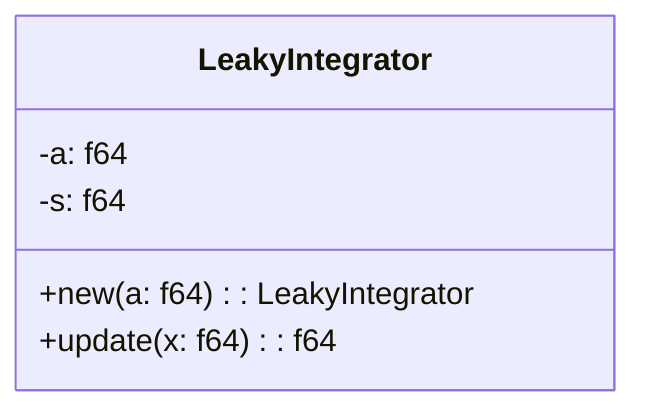
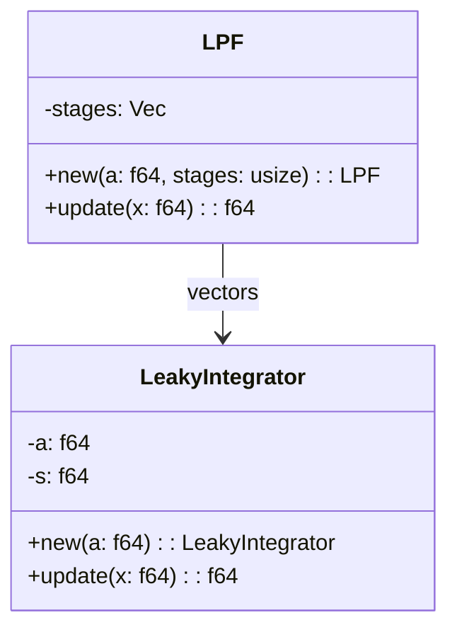

# Developing a Low Pass Filter in Rust: A Dive into Decoupled Design

## Introduction

Rust has emerged as a powerful systems programming language due to its robust safety protocols and superior speed. Here, we'll explore how to develop an effective Low Pass Filter (LPF) with Rust. The LPF is a fundamental component in various systems like audio processing, communications, and image enhancement. 

We emphasize design patterns in this guide, showing how to develop this component using an architecture that adheres to the principles of ‘decoupled design.' Decoupled design eases system updates and testing by breaking a system down into parts that operate independently. We'll explain the motivation behind this approach during the walkthrough.

## Step 1: Outline the Structure

To start, we’ll implement the simple leaky integrator, a universal signal smoothing algorithm, as our building block of the LPF:

```rust
pub struct LeakyIntegrator {
  a: f64,
  s: f64,
}

impl LeakyIntegrator {
  pub fn new(a: f64) -> LeakyIntegrator {
    LeakyIntegrator { a, s: 0.0 }
  }

  pub fn update(&mut self, x: f64) -> f64 {
    self.s = self.a * x + (1.0 - self.a) * self.s;
    self.s
  }
}
```

## Step 2: Decouple the Design

Next, we employ the Chain of Responsibility design pattern to build a more sophisticated LPF. This pattern promotes loose coupling by allowing more than one object to handle a request.

```rust
pub struct LPF {
  stages: Vec<LeakyIntegrator>,
}

impl LPF {
  pub fn new(a: f64, stages: usize) -> LPF {
    LPF { 
      stages: vec![LeakyIntegrator::new(a); stages],
    }
  }

  pub fn update(&mut self, x: f64) -> f64 {
    let mut x = x;
    for stage in &mut self.stages {
      x = stage.update(x);
    }
    x
  }
}
```

## Motivation Behind the Architecture

The motivation to use a decoupled architecture is manifold. Firstly, it allows for independent testing of the `LeakyIntegrator` class, enabling a ‘divide and conquer’ approach to problem-solving and fault identification. Secondly, since each LeakyIntegrator and the LPF can operate independently, this design allows for parallel processing, which greatly increases the overall performance of the system. Lastly, the use of the Chain of Responsibility design pattern achieves a system where requests move along a "chain" of handlers until one handles it, allowing for flexible and easy system modification.

## Conclusion

Rust offers robust features that make it highly suitable for systems development. In designing a Low Pass Filter, we saw how a decoupled design can facilitate system testing, update, and enhance system performance - a useful strategy for a programmer working with Rust. This design strategy and Rust's features combine to provide a solid foundation for developing reliable, efficient, and scalable systems, whether you're developing an LPF or any other component.

## Diagrams

To better understand the structure of the Low Pass Filter (LPF) program in Rust, let's visualize them using Mermaid, a simple and handy tool for creating diagrams and flowcharts.

Diagram for `LeakyIntegrator`:


This diagram represents the `LeakyIntegrator` class with two fields (`a` and `s`) and two methods (`new` and `update`). The `new` method is a constructor that takes an argument `a` and returns a new instance of `LeakyIntegrator`. The `update` method performs the leaky integrator algorithm.

Diagram for `LPF`:


This diagram represents two classes - `LeakyIntegrator` and `LPF`. The `LPF` class contains a vector of `LeakyIntegrator` instances represented by the `stages` variable and two methods (`new` and `update`). The relationship between the `LPF` and `LeakyIntegrator` classes is represented by a line - `LPF` employs `LeakyIntegrator`.

In conclusion, this design pattern known as the "Chain of Responsibility" pattern helps improve the modularity of the code as it allows an object to send commands without knowing which object will receive and handle them. This makes the handler chain decoupled and robust, facilitating easy modification and extending the functionality of the program. The encapsulation of `LeakyIntegrator` within `LPF` represents the stages in the chain. This design pattern allows each handler (in this case, each `LeakyIntegrator` stage) to handle the data or pass it along the chain (to the next `LeakyIntegrator` stage in `LPF`).
