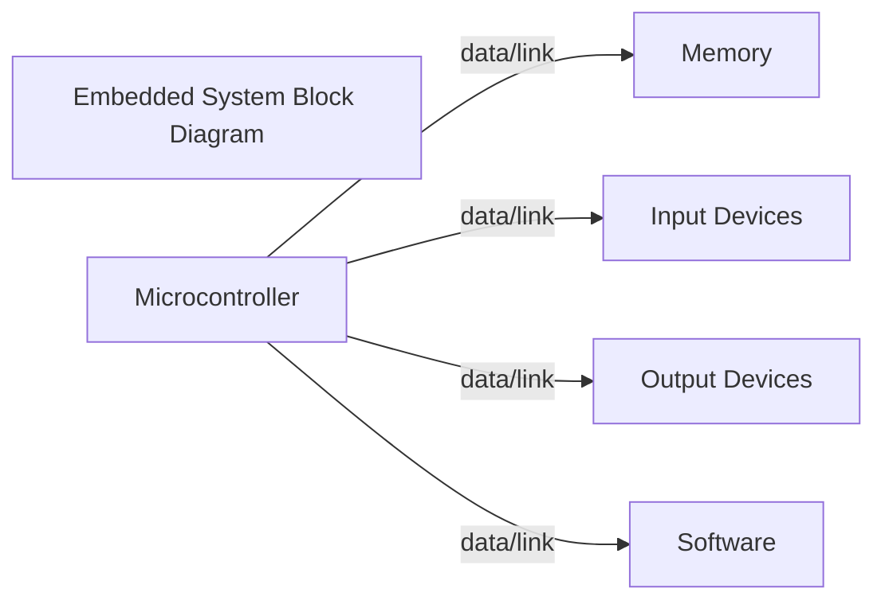
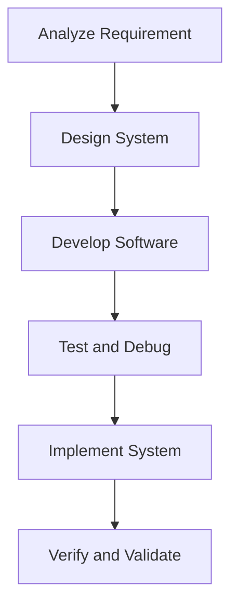
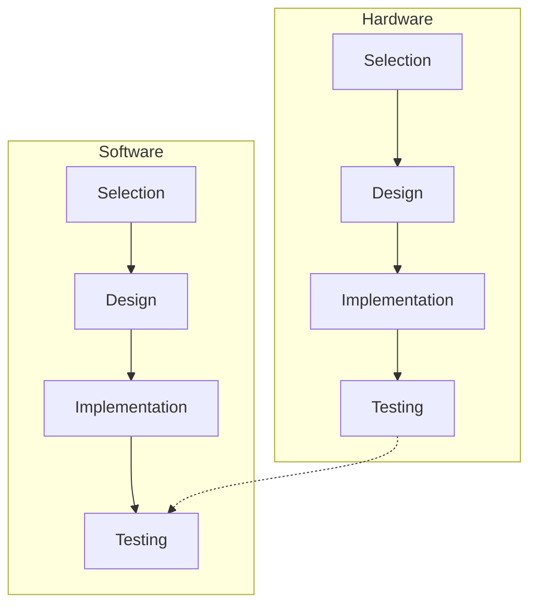

## Navigating the World of Embedded System Architecture: A Brief Overview     

Embedded systems have been redefining our everyday experiences from appliances in our homes to the leading-edge technology used in industries. These computer systems, with a dedicated function within a larger mechanical or electrical system, have become a fundamental part of our digital fabric. Central to these innovations is the role of an embedded system architect — the visionary and technical expert behind these intricate combinations of hardware and software elements. 

An embedded system architect boasts a multidimensional role that encompasses various aspects, from developing software for embedded computing systems to creating problem-solving algorithms and managing diverse project requirements. Despite the sheer complexity and diversity of the work, its essence lies in designing efficient, reliable, and robust systems that can perform a dedicated function in real-time.

First and foremost, embedded system architects need to have a deep understanding of microprocessors and microcontrollers, which are the driving forces behind such embedded systems. It’s about carefully selecting the most suitable processor based on factors like speed, power consumption, cost, and intended application of the final product.

The architect starts with examining the design requirements, which entails a comprehensive understanding of what the system needs to accomplish. This step involves extensive consultation with other experts such as system designers and hardware engineers to align everyone's understanding and ensure the functionality delivered fulfills the established objectives. 

Once the purpose is clear, the next step is designing the system. A comprehensive system design defines how the embedded system will work. This necessitates a detailed understanding of hardware-software co-design, as the two components need to harmoniously merge. An architect needs to have broad knowledge across a spectrum of languages and tools for programming, as the choice of language plays a critical part in the design and efficiency of the system.

Tests and simulations are integral parts of the process and should go hand in hand with the design phase. Prototypes are tested under different scenarios to ensure their effectiveness and reliability. Issues are identified, debugged, and resolved in this phase.

Once an efficient design is in place, implementation follows. The architect must translate the design into a functional system, which requires thorough hardware-software integration skills. After implementation, the system undergoes rigorous testing to ensure it aligns perfectly with the design requirements.

Lastly, an often overlooked but critical role of an embedded system architect is documentation. It’s crucial to meticulously record the design and development process. This provides a roadmap for anyone needing to understand the system architecture or work on its maintenance or upgrade in the future. 

In sum, the role of an embedded system architect not only requires design and technical skills but also needs strategic thinking, an understanding of various disciplines, effective communication, and a passion for problem-solving. The architecture of an embedded system is the backbone of its functionality, dictating its efficiency, reliability, and success in the real world. 

It's an exciting time in the world of embedded systems as we continue to push the boundaries of technological possibilities. With the increasing reliance on intelligent devices and systems, the demand for embedded system architects is also set to rise, making it a dynamic and promising career path in the global tech industry. As with all technology-related fields, staying up-to-date with ongoing trends and developments is a must. The future holds exciting possibilities, and only time will tell what revolutionizing innovations embedded systems will bring to our lives.

## Block Diagram of an Embedded System

An embedded system primarily consists of a microcontroller, memory, input devices, output devices and software. This is succinctly illustrated as:

Each component plays a crucial role in the overall operation of the embedded system.

## System Design Process

Designing an embedded system starts from requirement analysis and continues through design, development, testing, implementation, all the way to verification and validation. Here's a nifty flow diagram to describe the process:

## Hardware-Software Co-design Process

A seamless sync between hardware and software is non-negotiable in the world of embedded systems as it ensures optimal performance. The co-design process for both is as follows:

