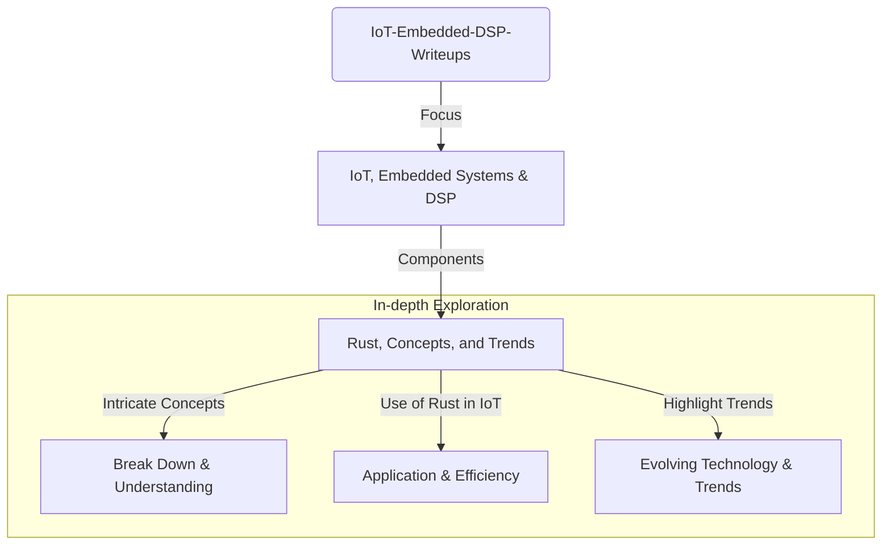

# IoT-Embedded-DSP-Writeups
A treasure-trove of explorations focused on the IoT, embedded systems, and DSP. Here, we break down intricate concepts, explore the use of Rust in IoT, and highlight trends. It's an enlightening ride for developers and tech enthusiasts alike.

* [Emergence of Rust](EmergenceOfRust.md) (~3 minutes of reading; 01.10.23)
* [Becoming an Exceptional Embedded Software Architect](BecomingAnExceptionalEmbeddedSoftwareArchitect.md) (~5 minutes of reading; 08.10.23)
* [Navigating the World of Embedded System Architecture: A Brief Overview](NavigatingTheWorldOfEmbeddedSystemArchitecture.md) (~5 minutes of reading; 17.10.23)
* [Developing a Low Pass Filter in Rust: A Dive into Decoupled Design](DevelopingLowPassFilterInRust.md) (~5 minutes of reading; 20.10.23)
* [Securing IoT Devices with Rust: Best Practices and Strategies](SecuringIotDevicesWithRust.md) (~5 minutes of reading; 16.10.23)
* [Understanding Power Constraints in IoT](UnderstandingPowerConstraintsInIot.md) (~7 minutes of reading; 09.09.24)
* [Exploring Advanced Concurrency Patterns in Rust for Embedded Systems](ExploringAdvancedConcurrencyPatternsInRust.md) (~7 minutes of reading; 11.09.24)
* [Optimizing Memory Usage in Rust for Embedded Systems](OptimizingMemoryUsageInRust.md) (~6 minutes of reading; 13.09.24)
* [Mastering Interrupt-Driven Design in Embedded Systems with Rust](MasteringInterrupt-DrivenDesignWithRust.md) (~10 minutes of reading; 17.09.24)
* [Harnessing the Power of DSP in Embedded Systems](HarnessingThePowerOfDSP.md) (~8 minutes of reading; 18.09.24)
* [Leveraging DSP Intrinsics in Rust for High-Performance Embedded Applications](LeveragingDspIntrinsicsInRust.md) (~8 minutes of reading; 23.09.24)
* [Integrating Rust with Real-Time Operating Systems (RTOS) in Embedded Systems](IntegratingRustWithRealTimeOperatingSystems.md) (10 minutes of reading; 25.09.24)
* [Getting Started with TinyML in Rust](GettingStartedWithTinyMLInRust.md) (10 minutes of reading; 10.12.24)

## In research:

I’m currently exploring a series of research topics centered around bringing machine learning to embedded systems using Rust. These include: getting started with TinyML and Rust toolchains, comparing various edge ML frameworks, optimizing model performance and memory usage, incorporating hardware accelerators, achieving real-time inference under RTOS constraints, bolstering security and privacy in on-device ML, and employing advanced debugging and profiling strategies. Each area aims to uncover best practices, tools, and techniques for efficiently and safely running machine learning models on resource-limited, Rust-based embedded platforms.

Some of the topics that could apear in some months:
* Comparing Edge ML Frameworks for Rust
* Optimizing Model Inference Performance and Memory Footprint in Rust
* Integrating Hardware Acceleration for TinyML in Rust
* Ensuring Real-Time and Low-Latency Inference with Rust and RTOS
* Debugging and Profiling TinyML Applications in Rust
 

