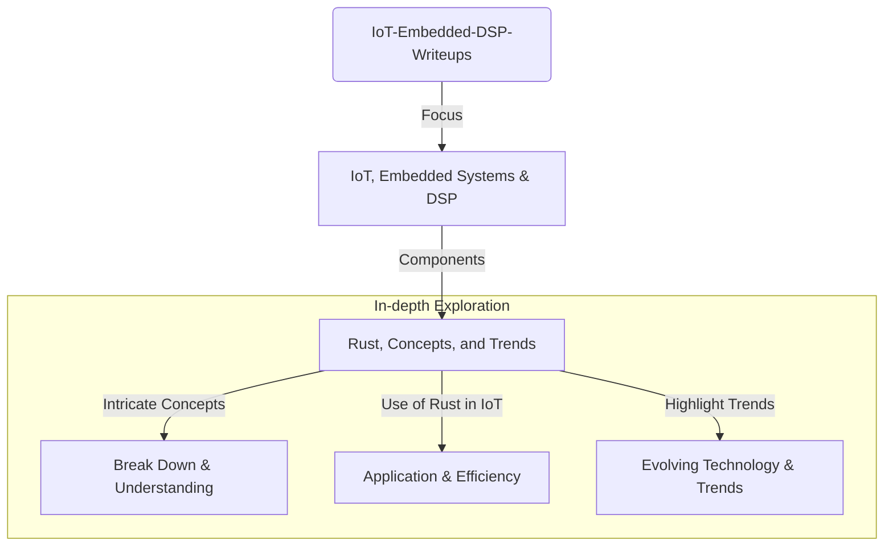

# IoT-Embedded-DSP-Writeups

A treasure-trove of explorations focused on the IoT, embedded systems, and DSP. Here, we break down intricate concepts, explore the use of Rust in IoT, and highlight trends. It's an enlightening ride for developers and tech enthusiasts alike.

```mermaid
flowchart TB
    id1(IoT-Embedded-DSP-Writeups) -->|Focus| id2["IoT, Embedded Systems & DSP"]
    id2 -->|Components| id3["Rust, Concepts, and Trends"]
    subgraph sg1["In-depth Exploration"]
        id3 -->|Intricate Concepts| id4[Break Down & Understanding]
        id3 -->|Use of Rust in IoT| id5[Application & Efficiency]
        id3 -->|Highlight Trends| id6[Evolving Technology & Trends]
    end
```

* [Emergence of Rust](EmergenceOfRust.md) (~3 minutes of reading; 01.10.23)
* [Becoming an Exceptional Embedded Software Architect](BecomingAnExceptionalEmbeddedSoftwareArchitect.md) (~5 minutes of reading; 08.10.23)
* [Navigating the World of Embedded System Architecture: A Brief Overview](NavigatingTheWorldOfEmbeddedSystemArchitecture.md) (~5 minutes of reading; 17.10.23)
* [Developing a Low Pass Filter in Rust: A Dive into Decoupled Design](DevelopingLowPassFilterInRust.md) (~5 minutes of reading; 20.10.23)
* [Securing IoT Devices with Rust: Best Practices and Strategies](SecuringIotDevicesWithRust.md) (~5 minutes of reading; 16.10.23)
* [Understanding Power Constraints in IoT](UnderstandingPowerConstraintsInIot.md) (~7 minutes of reading; 09.09.24)
* [Exploring Advanced Concurrency Patterns in Rust for Embedded Systems](ExploringAdvancedConcurrencyPatternsInRust.md) (~7 minutes of reading; 11.09.24)
* [Optimizing Memory Usage in Rust for Embedded Systems](OptimizingMemoryUsageInRust.md) (~6 minutes of reading; 13.09.24)
* [Mastering Interrupt-Driven Design in Embedded Systems with Rust](MasteringInterrupt-DrivenDesignWithRust.md) (~10 minutes of reading; 17.09.24)
* [Harnessing the Power of DSP in Embedded Systems](HarnessingThePowerOfDSP.md) (~8 minutes of reading; 18.09.24)
* [Leveraging DSP Intrinsics in Rust for High-Performance Embedded Applications](LeveragingDspIntrinsicsInRust.md) (~8 minutes of reading; 23.09.24)
* [Integrating Rust with Real-Time Operating Systems (RTOS) in Embedded Systems](IntegratingRustWithRealTimeOperatingSystems.md) (10 minutes of reading; 25.09.24)
* [Getting Started with TinyML in Rust](GettingStartedWithTinyMLInRust.md) (10 minutes of reading; 10.12.24)
* [Comparing Edge ML Frameworks for Rust](ComparingEdgeMlFrameworksForRust.md) (9 minutes of reading; 15.12.24)
* [Optimizing Model Inference Performance and Memory Footprint in Rust](OptimizingModelInferencePerformanceAndMemoryFootprintInRust.md) (7 minutes of reading; 26.12.24)
* [Integrating Hardware Acceleration for TinyML in Rust](IntegratingHardwareAccelerationForTinyMLInRust.md) (7 minutes of reading; 31.12.24)
* [Ensuring Real-Time and Low-Latency inference with rust and RTOS](EnsuringReal-TimeAndLow-LatencyInferenceWithRustAndRTOS.md) (7 minutes of reading; 09.12.24)
* [Securing On-Device Machine Learning in Rust](SecuringOnDeviceMLInRust.md) (~9 minutes of reading; 17.02.25)
* [Building an End-to-End TinyML Pipeline in Rust](BuildingAnEndToEndTinyMLPipelineInRust.md) (~9 minutes of reading; 11.03.25)
* [Power Management Strategies for TinyML Applications in Rust](PowerManagementForTinyMLInRust.md) (~8 minutes of reading; 23.04.25)
* [Anomaly Detection at the Edge with Rust and TinyML](AnomalyDetectionAtTheEdgeWithRust.md) (~8 minutes of reading; 14.05.25)
* [Over-the-Air Model Updates for Embedded Rust Systems](OtaModelUpdatesForEmbeddedRust.md) (~9 minutes of reading; 07.06.25)
* [Rust on STM32: Practical Peripherals, HAL Abstractions, and the H7](RustOnSTM32PracticalPeripherals.md) (~9 minutes of reading; 26.07.25)
* [Rust on nRF52: BLE, Low-Power Modes, and the Embassy Async Runtime](RustOnnRF52BLEAndLowPower.md) (~8 minutes of reading; 09.08.25)
* [Thread and Matter: The New IoT Connectivity Stack and Where Rust Fits](ThreadAndMatterTheNewIoTStack.md) (~9 minutes of reading; 19.09.25)
* [nRF54 and Ultra-Low Power Embedded Rust: Reaching 30µA and Below](nRF54UltraLowPowerEmbeddedRust.md) (~9 minutes of reading; 31.10.25)
* [CAN Bus with STM32 in Rust: Industrial Communication for Embedded Systems](CANBusWithSTM32InRust.md) (~9 minutes of reading; 15.11.25)
* [IoT Platforms in Practice: ThingsBoard, Data Pipelines, and Connecting Embedded Rust to the Cloud](IoTPlatformsThingsBoardAndEmbeddedRust.md) (~9 minutes of reading; 28.12.25)
* [C++ in Embedded Systems: Power, Pitfalls, and When to Use It](CppInEmbeddedSystems.md) (~9 minutes of reading; 19.01.26)
* [Debugging and Profiling TinyML Applications in Rust](DebuggingAndProfilingTinyMLApplicationsInRust.md) (~8 minutes of reading; 24.02.26)

## In research:

I’m currently exploring a series of research topics centered around bringing machine learning to embedded systems using Rust. These include: getting started with TinyML and Rust toolchains, comparing various edge ML frameworks, optimizing model performance and memory usage, incorporating hardware accelerators, achieving real-time inference under RTOS constraints, bolstering security and privacy in on-device ML, and employing advanced debugging and profiling strategies. Each area aims to uncover best practices, tools, and techniques for efficiently and safely running machine learning models on resource-limited, Rust-based embedded platforms.

Some of the topics that could apear in some months:
 

