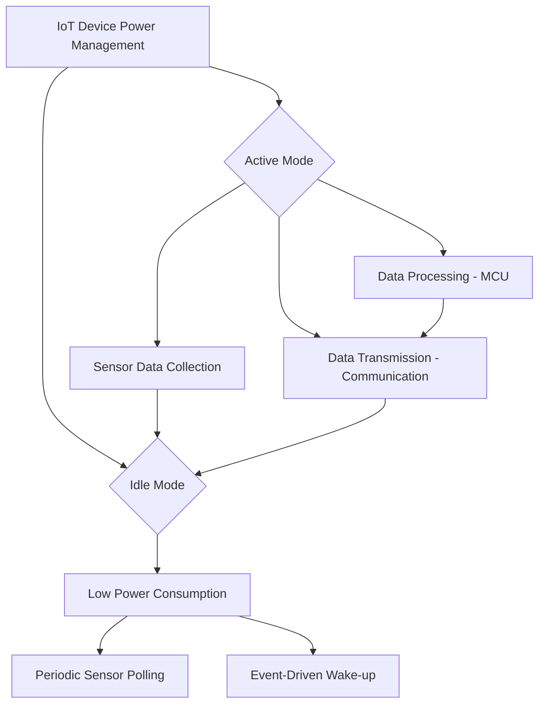

# Understanding Power Constraints in IoT Devices

As IoT applications expand across various domains—such as remote environmental monitoring, smart agriculture, and wearable tech—one of the primary challenges is managing power consumption. Many IoT devices are deployed in environments where replacing or recharging batteries is impractical, leading to a demand for highly efficient, low-power designs. Let’s take a detailed look at the power consumption challenges faced by IoT devices, focusing on cutting-edge solutions and technologies.

## 1. Limited Energy Resources
Most IoT devices are powered by batteries or small solar panels. For instance, a soil moisture sensor in a smart farming setup might be deployed in a remote field for years with only a small battery or solar cell. Given the limited energy availability, these devices must operate with ultra-low power consumption to maximize lifespan.

### Example Technologies:
- **Energy Harvesting Systems**: Technologies like solar, piezoelectric, or thermal energy harvesters are integrated to supplement battery power. For instance, Texas Instruments' **BQ25570** is an energy harvesting power management device designed for IoT, which efficiently captures and stores energy from tiny sources like solar panels.
- **Ultra-low-power MCUs**: Chips like the **Ambiq Apollo4** have advanced power management, achieving ultra-low active and standby power. These processors use techniques like sub-threshold voltage operation, which can extend battery life dramatically.

## 2. Energy-Hungry Components
IoT devices are typically equipped with various power-hungry components such as sensors, processors, and communication modules. For example, in a health-monitoring wearable device, sensors continuously track heart rate, and a processor aggregates and transmits data.

### Example Technologies:
- **Low-Power Sensor Interfaces**: Companies like Bosch and STMicroelectronics have developed low-power MEMS sensors. Bosch’s **BME280** environmental sensor, for instance, has ultra-low-power modes designed specifically for battery-powered IoT applications.
- **Efficient DSPs**: Digital signal processors (DSPs) are crucial for processing sensor data, especially in applications like audio and image processing. The **Tensilica HiFi DSP**, used in audio applications, provides high performance while maintaining low energy consumption.

## 3. Idle Power Consumption
Even when IoT devices are idle, they consume power in standby or sleep modes. For example, a temperature sensor in a smart thermostat might spend most of its time in sleep mode, waking only periodically to check and report temperature readings.

### Example Technologies:
- **Dynamic Power Modes**: Microcontrollers like the **Nordic nRF52840** have sophisticated power management features that allow devices to enter ultra-low-power sleep modes. These modes can be triggered when no critical tasks are running, reducing power draw to microamp levels while keeping the device responsive to wake-up events.
- **Event-Driven Architectures**: Instead of polling sensors, many IoT devices now use interrupt-driven architectures, where the processor remains in sleep mode until a sensor event (e.g., motion detected by a PIR sensor) triggers a wake-up. This approach conserves energy significantly compared to continuous polling.

## 4. Data Transmission Costs
Transmitting data over wireless networks is one of the most energy-intensive tasks for IoT devices. For instance, a smart water meter transmitting hourly usage data over Wi-Fi will drain its battery quickly.

### Example Technologies:
- **Low-Power Wide Area Networks (LPWAN)**: Technologies like **LoRaWAN** and **NB-IoT** offer long-range, low-power communication designed for IoT. For example, a LoRa-based smart city sensor might transmit data over 10 km using minimal power, extending battery life to several years.
- **Edge Computing**: By processing data locally on the device rather than transmitting raw data to the cloud, IoT devices can significantly reduce transmission energy. Chips like **NVIDIA Jetson Nano** enable lightweight AI and data processing at the edge, so only critical insights are transmitted.

## 5. Power Management and Efficiency Trade-offs
Balancing performance with energy consumption is a constant trade-off in IoT devices. For instance, a high-frequency sensor that provides detailed environmental data consumes more power than one with a lower sampling rate. However, modern designs aim to strike a balance between accuracy and efficiency.

### Example Technologies:
- **Adaptive Sampling**: IoT systems can implement adaptive sampling strategies where the frequency of sensor readings is dynamically adjusted based on the situation. For example, a weather station might sample data every minute during a storm but only once an hour on clear days.
- **On-Demand Communications**: Instead of constant data transmission, some IoT devices employ on-demand communication protocols. **Bluetooth Low Energy (BLE)**, for instance, is ideal for short-range communication with low latency and minimal power draw, as seen in wearables like fitness trackers.

---

## Key Takeaways
The rapid advancement of IoT technologies has led to various strategies to address power consumption challenges. By using energy-efficient components, dynamic power management, and advanced communication technologies, IoT devices can now operate for years on limited energy sources like small batteries or solar panels. Cutting-edge MCUs, sensors, and LPWAN networks like LoRa and NB-IoT are shaping the next generation of IoT devices, enabling long-term deployment in energy-constrained environments.
